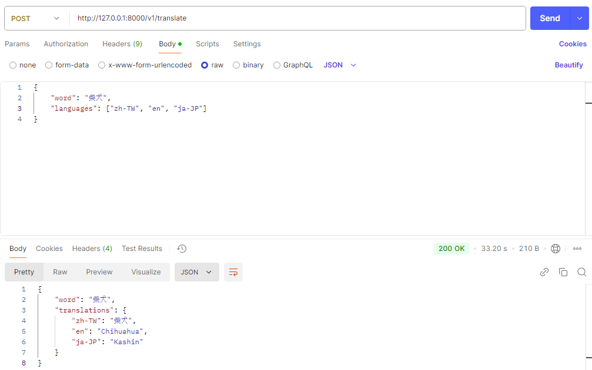

# LLM

## Versions

- Python: 3.10.11

## Models

- [Hugging Face](https://huggingface.co/models)
- [Mistral-7B-Instruct-v0.3](https://huggingface.co/mistralai/Mistral-7B-Instruct-v0.3/tree/main)
- [Qwen2-1.5B-Instruct](https://huggingface.co/Qwen/Qwen2-1.5B-Instruct/tree/main)

## Usage

- Use `docker-compose up -d`, or install Python locally (recommended)
- Download model from `Hugging Face`
- Place it under `./models` directory
- Update the model string in `config.py` to your model folder
- Set up local environment `python deploy.py`
- Test results `python test_translate.py`

## Demo

- 
